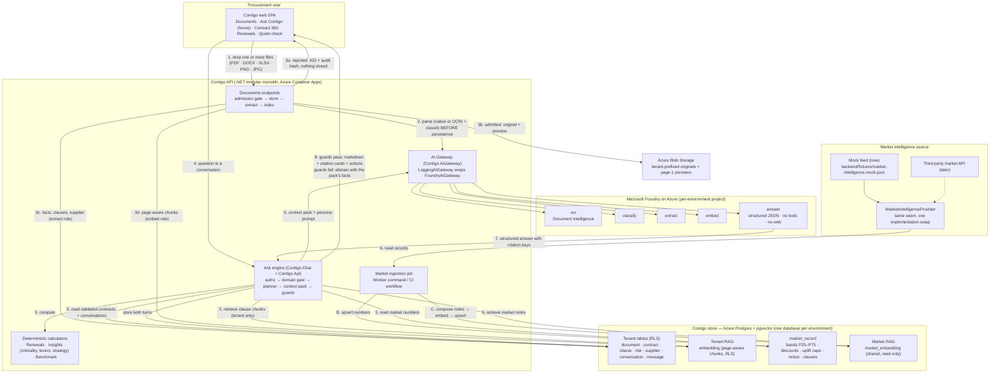

# Ask Contigo V2 — architecture and data flow

Binding decisions: `.helix/reports/architecture/ADR-024-ask-contigo-v2.md`,
requirements `.helix/inputs/requirements.md` (§2 "three sources, one
rule", §5.8 market intelligence). Design reference: `.helix/inputs/design/prototypes/Contigo V2 Prototype.html`
(unpacked under `.helix/inputs/design/prototypes/contigo-v2/`).

**The one rule.** Ask Contigo answers only from Contigo's own store —
Postgres tables and the two RAG indexes in the same database — plus its
deterministic calculators. Foundry on Azure reads, classifies, embeds and
narrates; it never browses the web and carries no tools. The market
intelligence source (mock feed today, third-party API later) is read
**only by the ingestion job**, never at question time.

## 1. Component and data flow



Reading the numbers: **1–3** is the Documents path (HITL D1, D3: uploads
only in Documents, non-contracts refused before anything is written);
**A–C** is the only path that reads the market source; **4–8** is one Ask
turn. There is no edge from the Ask engine to the market source and no
edge from Foundry to the internet.

## 2. One Ask turn, in sequence

```mermaid
sequenceDiagram
  autonumber
  actor U as Procurement user
  participant SPA as Web SPA (/ask)
  participant API as Contigo API
  participant PG as Postgres + pgvector<br/>(tenant tables · tenant RAG · market_record · market RAG)
  participant F as Foundry on Azure<br/>(classify · embed · answer)
  participant G as Guards<br/>(grounding · numeric · actions)

  U->>SPA: "Is my Allianz contract above market?"
  SPA->>API: POST /api/conversations/{id}/messages (X-Tenant-Id, X-User-Id)
  API->>API: authorization scope (tenant, user, role)
  API->>API: domain gate — greeting / off-domain / legal / capability / needs-document / in-domain
  opt ambiguous turn
    API->>F: classify (fixed label set)
    F-->>API: label + confidence
  end
  API->>API: planner — fixed intents (market_compare, renewal_strategy, portfolio_strategy, ...)
  API->>PG: validated contract facts, clauses, weak facts (RLS)
  API->>F: embed (question)
  F-->>API: vector
  API->>PG: tenant RAG top-k (tenant_id filter) + market RAG top-k + market_record bands
  API->>API: calculators — bands vs unit price, levers, criticality, strategy pack
  API->>F: answer (persona prompt + context pack + last turns; no tools)
  F-->>API: JSON { canDetermine, answerMarkdown, citationKeys, actionKeys, followUps }
  API->>G: verify every citation key, number, date and action against the pack
  alt guards pass
    G-->>API: ok
  else violation
    G-->>API: regenerate once, then abstain with the pack's own facts
  end
  API->>PG: append user + Contigo messages (citations, actions, AI metadata hash)
  API-->>SPA: { kind, answerMarkdown, citations[], actions[], provenance, followUps[] }
  SPA-->>U: prose + citation cards (contract page · market record · Contigo feature) + deep links
```

## 3. Where each fact comes from

| Claim in an answer | Source of truth | Written by | Read at question time |
|---|---|---|---|
| Dates, spend, notice, uplift, liability of *your* contract | Postgres tenant tables (RLS) | Documents pipeline (extract role), user corrections | yes |
| Clause wording with page / section | Tenant RAG `embedding` | Documents pipeline (embed role) | yes, tenant-filtered |
| Market band P25–P75, discounts, uplift caps, notice norms | `market_record` | Ingestion job from the provider | yes |
| "Companies of your size usually obtain…" | Market RAG `market_embedding` | Ingestion job (notes → embed role) | yes |
| Opening / range / walk-away, criticality, strategy steps | Calculators (`Contigo.Insights`, `Contigo.Renewals`, `Contigo.Benchmark`) | computed per turn from the rows above | yes |
| "Open Renewals →", "Upload in Documents" | Capability catalog (`Contigo.Chat`) | versioned in code | yes |
| Anything else (web, model memory) | — | — | **never**; the guards abstain |

## 4. Environments

`dev` and `demo` each have their own Foundry project, Postgres database,
Blob container and Key Vault (ADR-006, ADR-008, ADR-011). The mock feed is
seeded per environment by `seed-market-intelligence.yml`; existing tenant
documents are re-OCR'd / re-embedded by `reprocess-tenant-documents.yml`
(epic-13, feature 11). Swapping the mock for the live provider is a new
`IMarketIntelligenceProvider` implementation behind the same ingestion
job — no change to the Ask engine, the store or the UI.
