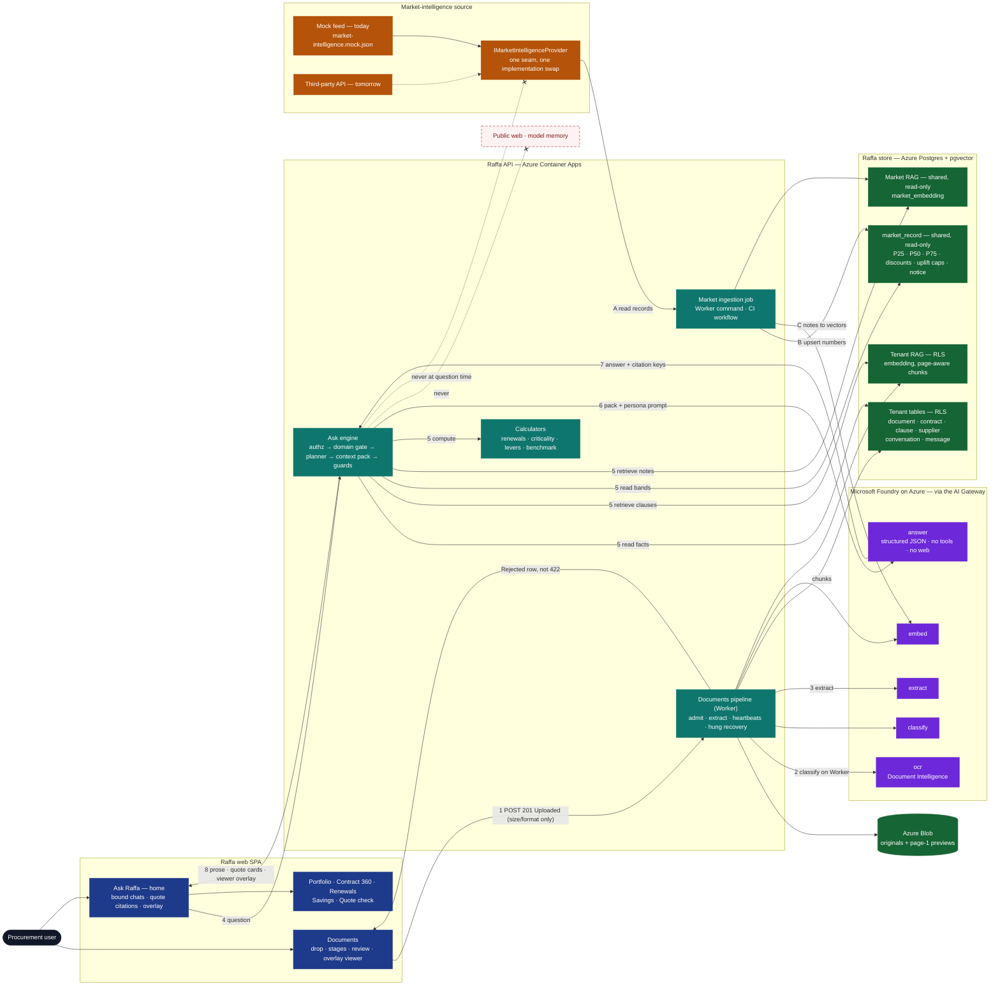
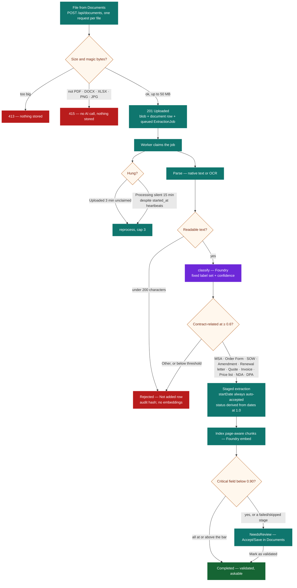
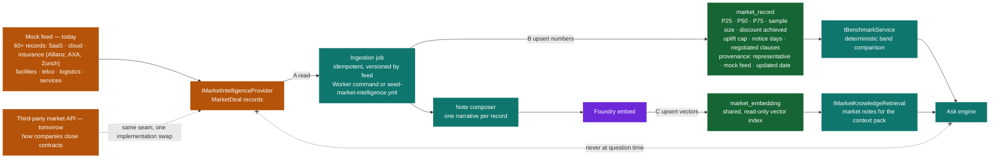
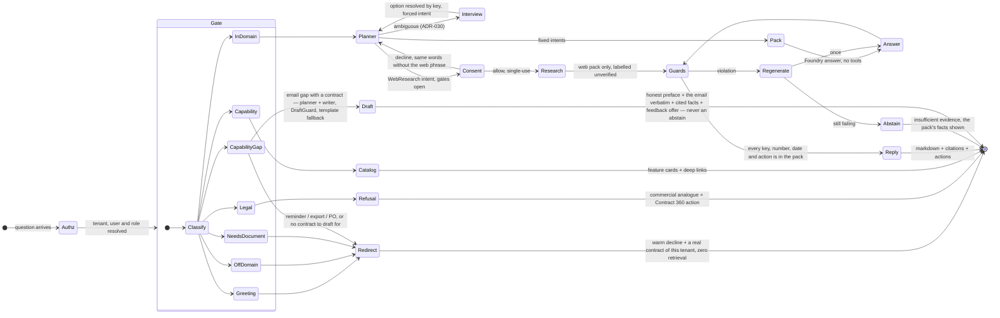
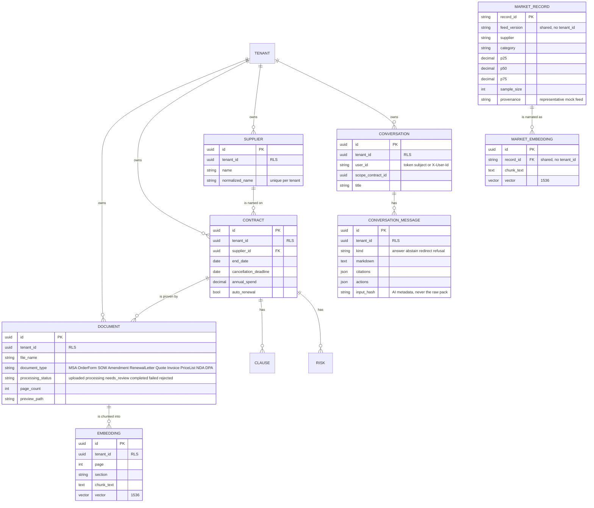
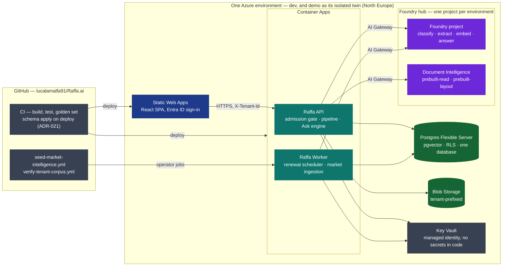

# Ask Raffa V2 — architecture and data flow

Buyer screens and the upload → review → validated path:
[`product-flow.md`](product-flow.md).

> **The one rule.** Ask Raffa answers only from Raffa's own store — the
> Postgres tables and the two vector indexes that live in the same database —
> plus its deterministic calculators. Microsoft Foundry on Azure reads,
> classifies, embeds and narrates; it carries **no tools and no web access**.
> The market-intelligence source (a mock feed today, a third-party API
> tomorrow) is read **only by the ingestion job**, never while a user is
> asking.

Binding decisions: [ADR-024](../../.helix/reports/architecture/ADR-024-ask-raffa-v2.md),
requirements [`requirements.md`](../../.helix/inputs/requirements.md) (§2 three
sources, §5.1 intake, §5.3 engine, §5.8 market intelligence).

**Colour legend used in every diagram**

| Colour | Meaning |
|---|---|
| dark blue | the user and the web SPA |
| teal | Raffa API — the modular monolith (gate, pipeline, engine, calculators, ingestion) |
| purple | Microsoft Foundry on Azure, always behind the AI Gateway |
| green | Raffa's store — Postgres + pgvector, Blob |
| amber | the market-intelligence source and its seam |
| red, dashed | paths that do **not** exist by design |

---

## 1. Big picture — three writers, one reader



Three things write into the store: the **Documents pipeline** (1–3, your
contracts, tenant-isolated by RLS), the **market ingestion job** (A–C, the
only path that ever touches the market source) and the **Ask engine**
(the two turns of every conversation). One thing reads at question time:
the Ask engine (4–8). There is no edge from the engine to the market
source and no edge from Foundry to the internet.

`POST /api/documents` stores the original and queues work; the Worker owns
classify/extract. A content refusal is a `Rejected` document row, not HTTP 422.

---

## 2. Documents intake — size and format on the request, content on the Worker



A format/size refusal never creates a row. A content refusal **does**:
`Rejected`, listed under Not added. Ask lights up from `Completed` documents.
Portfolio and Renewals also show not-yet-ready rows behind **To review**
(default view is **Ready**). Admin `DELETE /api/documents` purges files and
cascades the contracts, renewals, and scoped chats they produced.

---

## 3. Market intelligence — the source feeds the store, the store answers



Swapping the mock for the live API is one new implementation of
`IMarketIntelligenceProvider` behind the same job. Every market number Ask
shows carries its provenance label until the live provider lands. A thin
sample stays *insufficient market data* — never a precise-looking number.

---

## 4. One Ask turn, in sequence

```mermaid
sequenceDiagram
  autonumber
  actor U as Procurement user
  participant SPA as Web SPA — Ask Raffa
  participant API as Raffa API — Ask engine
  participant PG as Postgres + pgvector<br/>tenant tables · tenant RAG · market_record · market RAG
  participant F as Foundry on Azure<br/>classify · embed · answer
  participant G as Guards<br/>grounding · numeric · actions

  U->>SPA: Is my Allianz contract above market?
  Note over SPA: Bound chat: scopeContractId from 360, or a named supplier
  SPA->>API: POST /api/conversations/:id/messages
  rect rgb(224, 242, 254)
    Note over API: Authorization first — tenant, user, role — then scope id wins over same-name lookup
    API->>API: Domain gate — greeting · off-domain · legal · capability gap · capability · needs-document · in-domain
    opt ambiguous turn
      API->>F: classify with a fixed label set
      F-->>API: label + confidence
    end
    alt capability gap (ADR-030) — "send an email", "set a reminder", "export to Excel", "raise a PO"
      Note over API: honest preface in the question's language + the nearest alternative + a feedback offer
      alt email/letter gap with a resolved contract
        API->>PG: the Q3 pack — contract facts, levers, clauses, playbook (RLS)
        API->>F: council analysts + strategist · offer planner · negotiation writer (analyst role, strict JSON)
        F-->>API: subject · body · usedCitationKeys — no inline [n]
        API->>API: DraftGuard — no marker, no link, no id, every number in the pack · retry once · else template
        API-->>SPA: kind draft · preface · payload.draft · citations · Renewals / Contract 360 actions · feedbackOffer
      else reminder / export / PO, or no contract to draft for
        API-->>SPA: kind redirect · preface · Renewals / Portfolio / Contract 360 · feedbackOffer (+ one supplier per follow-up)
      end
    end
    API->>API: Planner — StructuredFact, Clause, MarketCompare, RenewalStrategy, PortfolioStrategy, PortfolioMarketPosition, WebResearch, …
    opt ambiguous question (ADR-030)
      API-->>SPA: interview — one question, server-authored options, zero retrieval, no model call
      U->>SPA: picks an option (or types)
      SPA->>API: POST … { interviewAnswer: { messageId, questionKey, optionKey } }
      Note over API: the option resolves by key to a rewrite + forced intent; the normal pipeline runs
    end
    opt explicit "search the web" (ADR-030, kill switch + workspace opt-in + budget all open)
      API-->>SPA: interview with presentation "consent" — the exact query, nothing of the contracts leaves
      U->>SPA: Allow (single-use) / Decline
      SPA->>API: POST … { interviewAnswer: { optionKey: "allow" | "decline" } }
    end
    opt notice question
      API-->>SPA: fallback answer from the bound contract — Foundry is not called
    end
  end
  rect rgb(254, 226, 226)
    Note over API,F: Web research — only after a consumed consent; a separate role, no pack in the request
    opt consent consumed
      API->>F: research (Responses API, one web_search tool, sanitised query)
      F-->>API: summary + url_citation sources
      API->>G: WebGuard · NumericGuard on the sources · GroundingGuard
      API-->>SPA: answer · citations corpus "web" · provenance.unverified = true
    end
  end
  rect rgb(220, 252, 231)
    Note over API,PG: Context pack — built only from Raffa's own store
    API->>PG: validated contract facts, clauses, weak facts (RLS)
    API->>F: embed the question
    F-->>API: vector
    API->>PG: tenant RAG top-k with tenant filter · market RAG top-k · market_record bands
    API->>API: calculators — band vs unit price, levers, criticality, strategy pack
  end
  rect rgb(237, 233, 254)
    Note over API,F: Narration — persona prompt + pack + last turns · no tools · no web
    API->>F: answer
    F-->>API: structured JSON — canDetermine, answerMarkdown, citationKeys, actionKeys, followUps
  end
  rect rgb(254, 243, 199)
    Note over API,G: Guards — every citation key, number, date and action must exist in the pack
    API->>G: verify
    alt guards pass
      G-->>API: ok
    else violation
      G-->>API: regenerate once, then abstain with the pack's own facts
    end
  end
  API->>PG: append both turns — citations, actions, AI metadata hash
  opt RenewalStrategy with a resolved contract
    API->>PG: upsert ranked negotiation TODOs on that renewal
  end
  API-->>SPA: kind · answerMarkdown · citations · actions · provenance · followUps · payload
  SPA-->>U: quote on the card · Open contract / Open at this span overlay · no guid in prose
  opt feedback card answered (ADR-030 D5)
    SPA->>API: POST /api/conversations/:id/feedback — messageId + three answers
    API->>PG: feature_request row (RLS) — stored first
    API-->>API: GitHub issue, best-effort — gap · answers · language · environment · workspace hash, never the question
    API->>PG: append the confirmation turn — payload.feedbackResult, an external action
    API-->>SPA: 201 · status · issue number · the confirmation turn
  end
```

---

## 5. Inside the engine — every question ends in exactly one kind of reply



Six layouts in the UI: `answer` (prose, one evidence card, buttons), `draft`
(the preface, the email card with **Copy email**, evidence, the feedback
card), `redirect` and `refusal` (warm prose + one CTA; a capability-gap
redirect adds one supplier per follow-up chip and the feedback card),
`abstain` (the accent-left block, only when there is truly nothing to stand
on) and `interview` (ADR-030: one clarifying question with clickable options,
or the consent alert when the option is "search the public web"). Every reply
also carries `payload` when it needs structured content — the drafted email,
the gap, the feedback offer or result — and `null` otherwise.

Web research (ADR-030) is a side path, never the main one: it needs the
environment's kill switch, the workspace Admin's opt-in and a daily budget
all open, and then a single-use consent on *that* question. The research
role is its own deployment and client (Responses API, one `web_search`
tool); its request has no slot for a pack, so nothing of the tenant can be
sent; its result is guarded like any other and always rendered as
"unverified" with its sources under their own section.

A bound notice question never reaches Foundry. `PortfolioMarketPosition`
is a planner destination (not Quote check) but has no pack yet — those
turns abstain. `RenewalStrategy` with a resolved contract persists
negotiation TODOs before the answer is composed.

---

## 6. The store — what is tenant-isolated and what is shared



Every tenant table carries `tenant_id` and a Postgres row-level-security
policy (ADR-009): the application passes the tenant, the database is the
backstop. The two market tables have no `tenant_id`: they are Raffa's own
knowledge, readable by every workspace, writable only by the ingestion job,
never joined with tenant rows.

---

## 7. Where it runs — `dev` and `demo`, isolated twins



`dev` deploys on every merge to `main`; `demo` is promoted by tag with a
required review (ADR-016). The two environments share no data, no identity
and no Foundry project (ADR-006, ADR-008, ADR-011).

---

## 8. Where each claim in an answer comes from

| Claim in an answer | Source of truth | Written by | Read at question time |
|---|---|---|---|
| Dates, spend, notice, uplift, liability of *your* contract | Postgres tenant tables (RLS) | Documents pipeline (extract role), your corrections | yes |
| Clause wording with page and section | Tenant RAG `embedding` | Documents pipeline (embed role) | yes, tenant-filtered |
| Market band P25–P75, discounts, uplift caps, notice norms | `market_record` | Ingestion job from the provider | yes |
| "Companies of your size usually obtain…" | Market RAG `market_embedding` | Ingestion job (notes → embed role) | yes |
| Opening / range / walk-away, criticality, strategy steps | Calculators — `Raffa.Insights`, `Raffa.Renewals`, `Raffa.Benchmark` | computed per turn from the rows above | yes |
| "Open Renewals →", "Upload in Documents" | Capability catalog — `Raffa.Chat` | versioned in code | yes |
| The drafted email's numbers, dates and asks (ADR-030) | The same pack — copied by the negotiation writer, or by the template | offer planner + writer (analyst role), guarded by `DraftGuard`/`NumericGuard`; template on failure | yes |
| "I can't send an email from Raffa.ai yet, but…" and the feedback card | Capability-gap catalog — `Raffa.Chat` (IT/EN, versioned in code) | deterministic, in the question's language | yes |
| "Open issue #123 →" | GitHub's own response to the feedback submission | server-authored `external` action, never the model | yes |
| Anything else — the web, the model's memory | — | — | **never**: the guards abstain |
