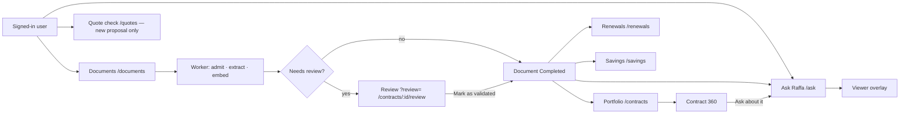

# Workspace product flow

How a Raffa workspace actually moves a contract from a file drop to Ask,
Portfolio, and Renewals. Binding for the screens: `web/src/components/shell/`
(rail, routes, global Ask bar) and the route folders named below.

Ask's engine (Foundry, pack, guards) is
[`ask-raffa-v2-data-flow.md`](ask-raffa-v2-data-flow.md). This file is the
buyer path.

Ask is home (`/` → `/ask`). Portfolio / Renewals / Quote check stay dim until
`GET /api/workspaces` reports at least one validated contract (a linked document
in `Completed`). Savings is never greyed.

---

## Documents

Route: `/documents`. Upload is `POST /api/documents` (one file per request;
the SPA batches). The request itself only checks tenancy, size, and magic-byte
format → **413** / **415**. Classification and extraction run on the **Worker**.
A 201 returns `processingStatus: Uploaded`.

| Status | What it means |
|--------|----------------|
| `Uploaded` | Row exists; Worker has not claimed the job |
| `Processing` | Claimed; `stage` is one of Uploading → Classifying → OCR / text → Sections & tables → Extracting facts → Validating schema |
| `NeedsReview` | Extraction finished; at least one field is below the 90% auto-accept bar (or a stage failed/skipped) |
| `Completed` | Validated — askable; lights Portfolio / Renewals / Ask |
| `Failed` | Gave up after retries |
| `Rejected` | Not a contract (or unreadable). List filter **Not added**. Not a 422 |

**Hung recovery** (`documentTable.ts`, `HungProcessingDetector`,
`HungProcessingRecoveryService`):

- **Uploaded** still unclaimed after **3 minutes** → one-shot
  `POST /api/documents/{id}/reprocess` (SPA; cap 3 attempts).
- **Processing** silent for **15 minutes** (no `claimed_at` / `started_at` /
  `completed_at` heartbeat) → abort and re-enqueue, or `Failed` after
  `MaxAttempts`. Live Foundry calls pulse `started_at` (~30 s) so a long extract
  is not treated as hung.

**Viewer** is an in-page overlay from Ask, Documents, Contract 360, and Review.
`/documents/:documentId/viewer` stays registered for deep links and new tabs.

**Delete all** (Admin, `DELETE /api/documents`): every tenant document, then
the contracts those files built, renewal actions/alerts, and Ask conversations
scoped to those contracts (`DocumentPurgeAllService`).

---

## Review

Opened as `/documents?review=<documentId>` or `/contracts/:id/review`. Same
session (`useReviewSession`).

- **Accept** / **Save** write `PATCH /api/contracts/{id}` and merge into the
  mounted table — no skeleton, no remount.
- Accepting the value already on the contract (or Save with the extracted text)
  **officializes** evidence as `human_accepted`.
- An extracted **start date** is always `auto_accepted` (presence, not the
  model's %).
- **Status** is derived from official start/end (`active` / `expired`) at
  confidence 1.0. The model wording is not left as `review_required` when dates
  exist.
- Other fields: auto-accept at **0.90** raw confidence; otherwise
  `review_required`. Critical fields: annual spend, TCV, cancellation deadline,
  end date, renewal term.
- **Mark as validated** → `POST /api/documents/{id}/validate` → `Completed`.

---

## Ask Raffa

Routes: `/ask`, `/ask/:conversationId`. Off until the first validated contract.

**Bind.** A chat is about one contract when:

- Contract 360 **Ask about it** (or the global bar on 360) creates it with
  `scopeContractId` (`/ask?scope=`), persisted on the conversation, or
- the question names a known supplier (domain gate → planner).

Scope **id** wins over a same-name lookup. A stale/foreign scope refuses.
Portfolio-wide intents (`PortfolioStrategy`, `PortfolioMarketPosition`) stay
workspace-wide even from a bound chat.

The bound chip is `{supplier} · {type}` and survives resume. The rail title is
`{supplier} — {type}` (never a guid, never the question). Search filters those
display titles. Delete is `DELETE /api/conversations/{id}` (caller's own chat).

The **global Ask bar** is unmounted on `/ask` and `/ask/:id`. Cmd/Ctrl+K focuses
that screen's composer instead.

**Intent** is deterministic (`IntentPlanner`), not chosen by the model:

| Intent | Typical question |
|--------|------------------|
| `StructuredFact` | dates, spend, notice |
| `Clause` | liability, termination, wording |
| `MarketCompare` | is this named contract in line with market? |
| `RenewalStrategy` | what to negotiate before this renewal (Q3) |
| `PortfolioStrategy` | which contracts are most critical |
| `PortfolioMarketPosition` | which of *my* contracts are off-market — **routes here, pack not built: honest abstain** |
| `Savings` | largest saving on one contract |
| `DocumentStatus` | what is not askable yet |
| `QuoteRoute` | new market proposal → Quote check, not the portfolio |

**Notice** ("when must we give notice…") short-circuits before Foundry: date
from the bound contract + clause citation when a page exists; never "which
supplier" if a contract is in scope.

**Renewal strategy (Q3)** ranks grounded negotiation points, persists the full
set to Renewals (`GET`/`PUT /api/renewals/{id}/negotiation-todos`), and narrates
the top 3 plus a `/renewals?select=` action.

**Citations.** Tenant cards show the document quote (`snippet`). A resolved
span is a two-CTA card: **Open contract** → 360, **Open at this span** → viewer
overlay. Market and Raffa (capability) cards stay single-action. Reply prose
strips guids (`humanizeReplyText`).

---

## Portfolio and Renewals

**Portfolio** (`/contracts`): all uploaded contracts that are not failed/rejected.
Default filter **Ready** (validated status, document not Uploaded/Processing/
NeedsReview). **To review** / **All** share the same loaded page. Column filters
are typed on the already-loaded rows: text (Supplier, Contract), date (Ends,
notice, Start), numeric contains on raw spend, select (Auto, Risk, Status).
`?category=` still hits `GET /api/contracts`.

Rows open Contract 360. **Ask about it** starts a bound chat.

**Renewals** (`/renewals`): priority list from validated dates. Same Ready /
To review / All control (`Determined` = ready). `?select=` pre-selects a row
(Q3 deep link). Selected pane: why it is here, actions, Negotiation TODOs.

**Savings** (`/savings`) is a rail item. Quote check is a new-proposal upload,
not a ranking of the stored portfolio.
